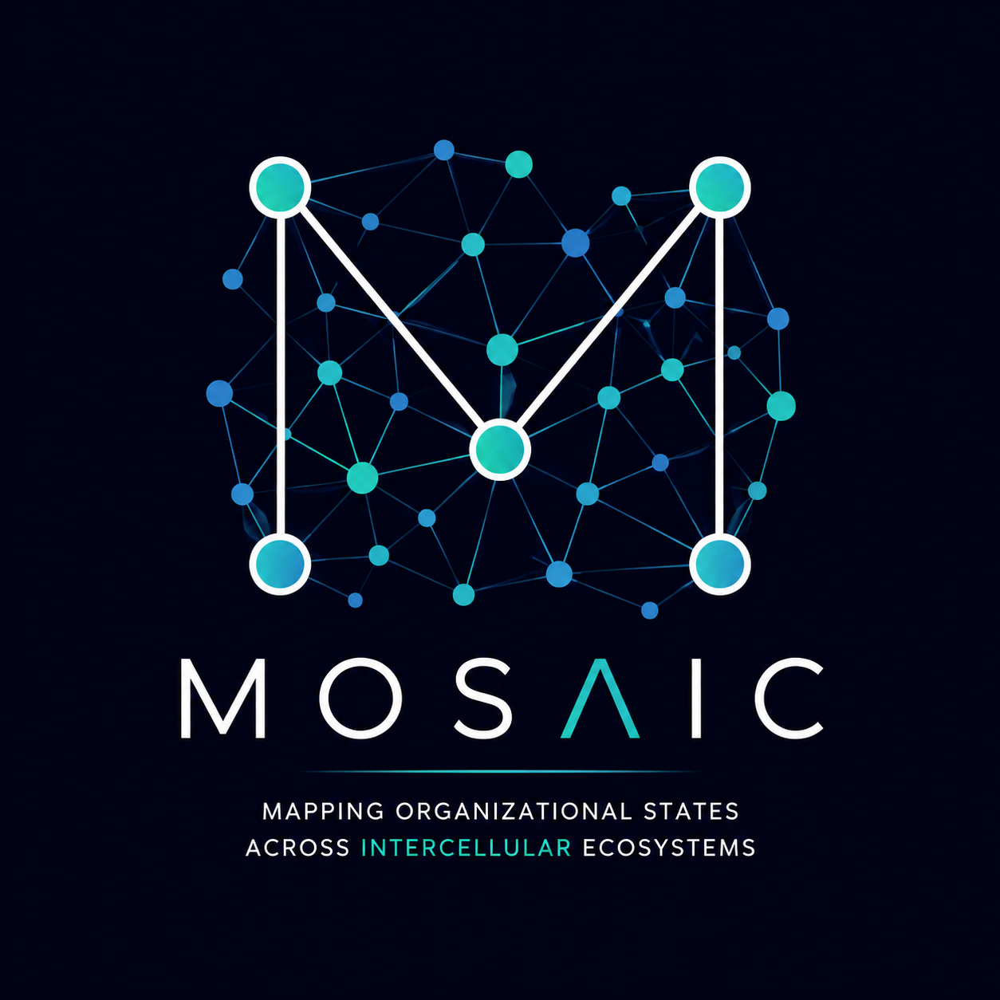

  

# MOSAIC

### Mapping Organizational States Across InterCellular Ecosystems
# MOSAIC

## Mapping Organizational States Across InterCellular Ecosystems

MOSAIC is a graph-native framework for understanding biological organization across spatial and multi-modal datasets.

Traditional spatial biology methods primarily focus on:

* Cell abundance
* Gene expression
* Cell phenotypes
* Pairwise interactions

While these measurements are essential, they do not fully capture how biological systems are organized.

MOSAIC was developed around a simple observation:

**Presence is not Architecture.**

Two tissues may contain similar cellular compositions yet exhibit profoundly different spatial organization, ecosystem structure, and biological behavior.

MOSAIC aims to represent biological systems as interconnected ecosystems where:

* Cells become nodes
* Spatial relationships become edges
* Neighborhoods become communities
* Tissues become ecosystems
* Organizational states emerge from network topology

---

## Framework Components

### MOSAIC-TLS

Detection and characterization of tertiary lymphoid structures (TLS).

Current implementation:

* TLS Finder

---

### MOSAIC-Network

Graph-based representation of cellular ecosystems.

Capabilities include:

* Cell-cell interaction networks
* Neighborhood analysis
* Community detection
* Graph topology metrics
* Centrality analysis

Technologies:

* NetworkX
* Neo4j
* Graph Data Science

---

### MOSAIC-Fingerprint

Identification of spatial ecosystem signatures and organizational states.

Potential applications:

* Patient stratification
* Biomarker discovery
* Therapy response prediction

---

### MOSAIC-KG

Biological knowledge graph layer.

Future integration of:

* Spatial data
* Molecular data
* Pathways
* Clinical outcomes
* Literature-derived relationships

---

## Current Development

Current development uses spatial single-cell datasets from the Broad Institute to explore graph-native representations of tissue ecosystems.

Initial focus areas include:

* Spatial architecture
* Cellular neighborhoods
* Cell-type interaction networks
* Community structure
* Ecosystem-level signatures

---

## Vision

The long-term goal of MOSAIC is to create a modality-agnostic framework capable of analyzing organizational states across:

* CODEX
* CosMx
* Xenium
* Visium
* Multiplex imaging
* Spatial transcriptomics
* Proteomics
* Future multi-modal platforms

---

## Core Principle

Biology is not merely composed of cells.

Biology is composed of relationships.

---

## Status

MOSAIC is currently under active development.

Framework paper and software modules are in preparation.

---

## Citation

Citation instructions will be provided upon formal framework publication.

---

## Author

Ayse A. Koksoy, MD, PhD

Computational Spatial Biologist

Spatial Omics • Graph Data Science • Scientific Software Development
